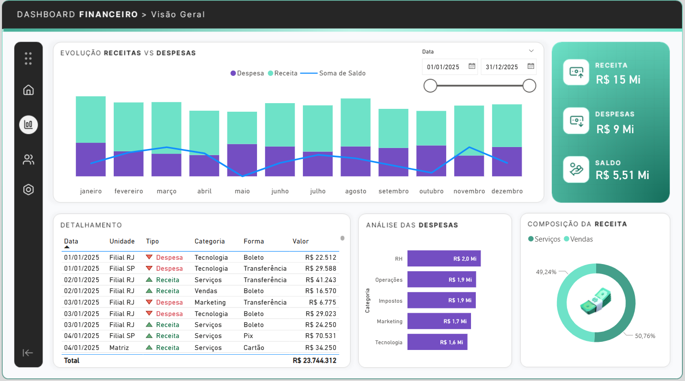

# 💰 Dashboard de Gestão Financeira (Intensivo Power BI + IA)

Este projeto foi desenvolvido durante a Aula 01 do curso Intensivo de Power BI + IA, ministrado por Letícia Smirelli. O objetivo foi criar uma solução de BI para monitoramento financeiro anual, integrando análise de fluxo de caixa e performance por unidade.

## 🛠️ Tecnologias e Processos
* **Ferramenta:** Microsoft Power BI
* **ETL (Power Query):** Normalização de tipos de dados, tratamento de extratos bancários e criação de colunas condicionais para classificação de natureza financeira.
* **Modelagem:** Estruturação de medidas para cálculo dinâmico de Saldo Líquido, Receita Acumulada e KPIs de performance.

## 📊 Funcionalidades do Dashboard
* **Visão Geral:** Monitoramento de Receita Bruta, Despesas Totais e Lucratividade.
* **Análise por Unidade:** Comparativo de performance entre Matriz, Filial SP e Filial RJ.
* **Composição de Receita:** Detalhamento por cliente e identificação de tendências de pagamento (Pix, Boleto, Cartão).
* **Detalhamento de Despesas:** Classificação por natureza operacional e não operacional.

## 📈 Insights de Negócio
O dashboard permite identificar quais unidades possuem maior margem de contribuição e monitorar o comportamento de pagamento dos principais clientes, otimizando a previsão de recebimentos e o controle de gastos operacionais.

## 📸 Visualização do Projeto

