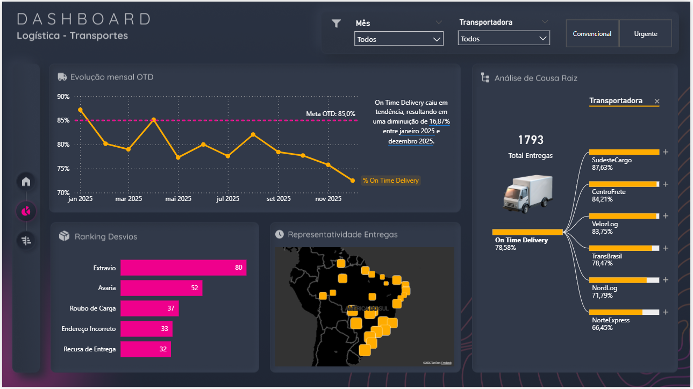

# 🚚 Dashboard de Logística e Transportes (Power BI + IA)

Este projeto foi desenvolvido na Aula 02 do curso Intensivo de Power BI + IA. O objetivo foi criar uma solução de BI para monitoramento de transporte de cargas, focado em pontualidade e análise de ocorrências.

## 🛠️ Tecnologias e Ferramentas
* **Power BI:** Desktop.
* **Power Query:** Tratamento de dados de fontes mistas (Excel e TXT), unificando históricos de transporte com cadastros de transportadoras.
* **DAX:** Criação de medidas de OTD (On Time Delivery), contagem de entregas e cálculos de variação percentual.
* **Smart Narratives (IA):** Implementação de resumo automático de insights para explicar tendências de queda ou alta na performance.

## 📊 Principais Indicadores e Funcionalidades
* **OTD (On Time Delivery):** Indicador de pontualidade comparado à meta de 85%.
* **Análise de Desvios:** Ranking dos principais problemas logísticos (Avaria, Extravio, Endereço Incorreto).
* **Performance por Transportadora:** Comparativo de nível de serviço entre os parceiros logísticos (VelozLog, NorteExpress, SudesteCargo, etc.).
* **Tooltips Visuais:** Detalhamento geográfico e por transportadora acessível através de interação dinâmica.

## 📈 Insights Extraídos
A ferramenta permite identificar rapidamente que a queda no OTD em determinados meses está atrelada a desvios específicos em regiões atendidas por certas transportadoras, possibilitando uma renegociação de prazos ou troca de fornecedores logísticos baseada em dados reais.

## 📸 Visualização do Projeto

